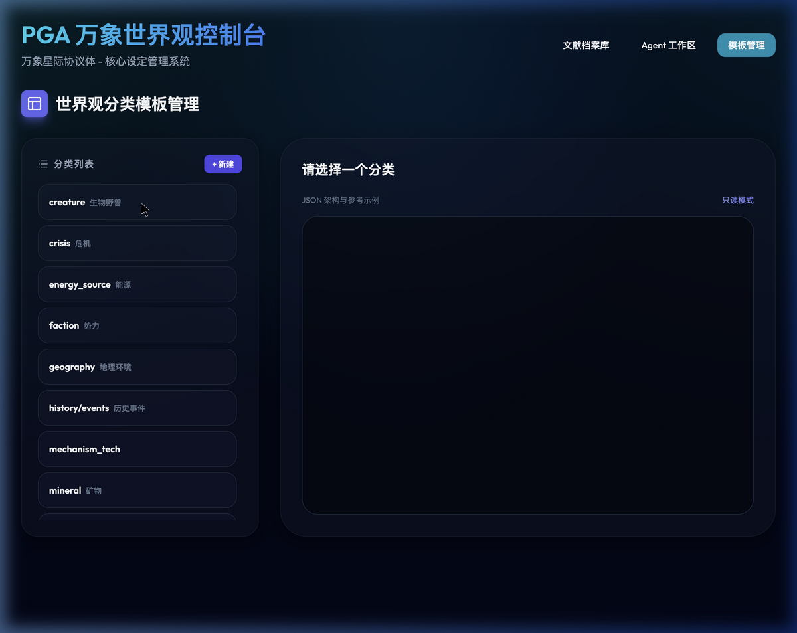
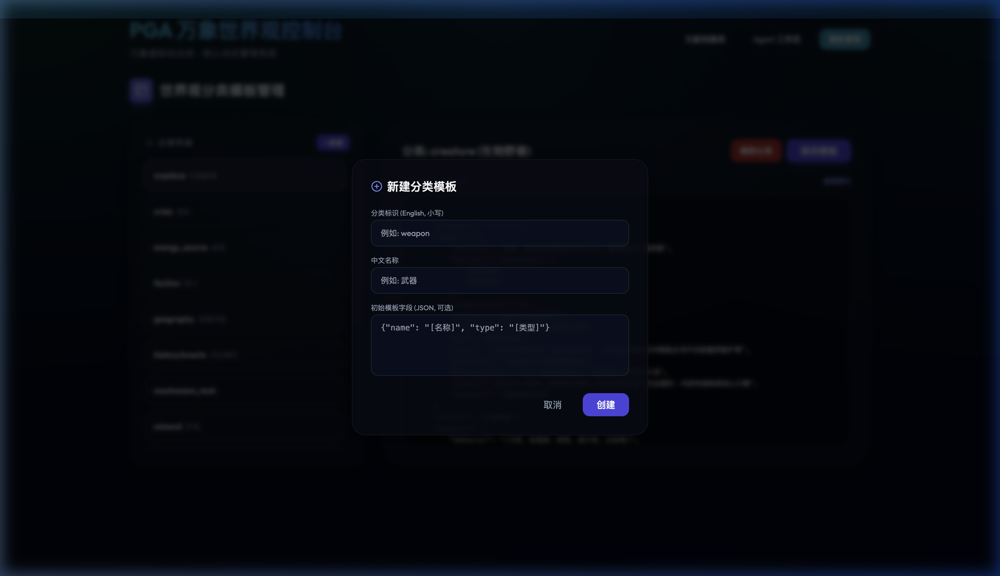
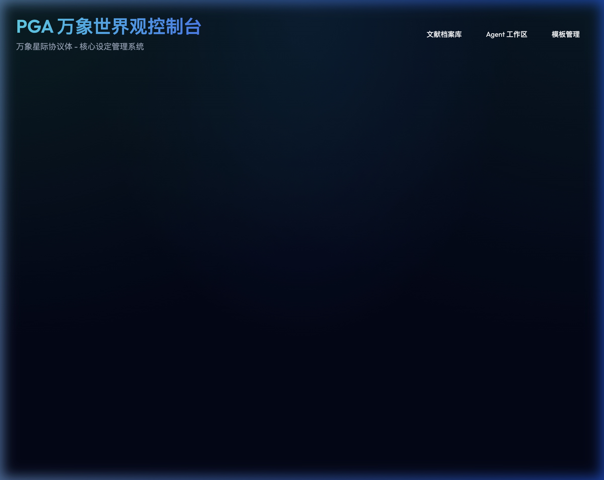
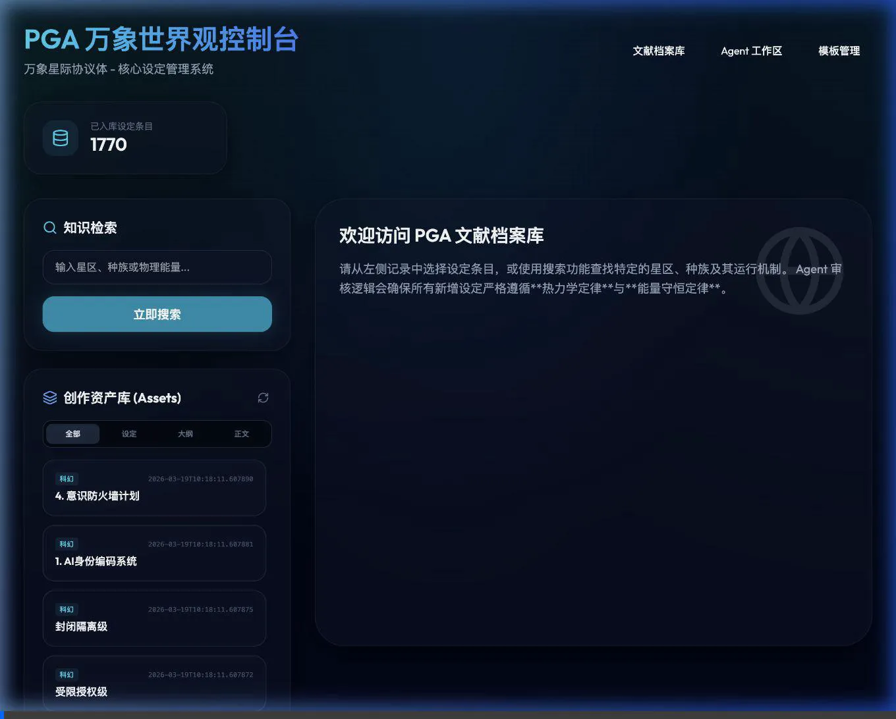

# Novel Agent (万象星际：AI 小说全链路创作引擎)

[English Version](./README_EN.md) | [中文版](./README.md)

> 本项目是一个基于 **LangGraph** 和 **Gemini** 驱动的专业小说创作与世界观管理系统。它通过 RAG（检索增强生成）和人机协作（Human-in-the-loop）将复杂的创作过程拆解为可管理的 Agent 流程，确保创作内容在长篇叙事中的高度一致性与逻辑严密性。

## 🌌 核心理念：结构化创作流程

系统将小说创作拆分为三个核心 Agent 阶段：

1. **世界观设定**：通过结构化模板定义种族、文明、技术、地理等底座设定。
2. **大纲规划**：基于世界观设定生成具有戏剧张力的剧情大纲与节奏控制。
3. **正文执行**：将大纲细化为具体场次，并生成带有“逻辑快照”的正文初稿。

---

### Technical Design Document: Worldview & Novel Agent

[English Version](./technical_design.md) | [中文版](./technical_design_ZH.md)

## ✨ 主要功能

### 1. 智能 Agent 矩阵

- **中转 Agent (Dispatcher)**: 语义识别与多级路由，自动分发请求至最匹配的子 Agent。
- **世界观 Agent (Worldview)**: 针对 Races, Geography, Factions 等多分类的设定生成与逻辑审计。
- **大纲 Agent (Outline)**: 结构化的小说策划，确保剧情冲突与世界观深度对齐。
- **正文 Agent (Execution)**: 基于“逻辑快照”的正文创作，通过场次拆解维持叙事连续性。

### 2. 世界观 Agent (Worldview Agent)

- **多维度设定**：支持 种族、势力、地理、机制、历史 等多维度设定。
- **模板化管理**：内置可视化模板 CRUD，支持手动编辑与 AI 自动补全。
- **语义分拣**：自动识别用户 Query 所属类别并提供针对性建议。

### 3. 小说大纲 Agent (Novel Outline Agent)

- **剧情节拍生成**：自动生成包含 序幕、发展、高潮、终局 的标准剧情节奏。
- **冲突挖掘**：自动分析设定中的核心冲突点，转化为故事张力。

### 4. 分布式技能体系 (Distributed Skill Architecture)

为了支持百万字以上的长篇巨著，系统引入了多级 SKILL 模块化管理：
- **框架法典 (Framework)**: 定义 Agent 的生成逻辑与审计红线。
- **核心锚点 (Lore/Anchors)**: 锁定不可修改的剧情转折与人物生死。
- **章节目录 (Catalog)**: 实现物理切片与活跃窗口管理，确保 Agent 在任何阶段都能高效处理任务。
-   **框架法典 (Framework)**: 定义 Agent 的生成逻辑与审计红线。
-   **核心锚点 (Lore/Anchors)**: 锁定不可修改的剧情转折与人物生死。
-   **章节目录 (Catalog)**: 实现物理切片与活跃窗口管理，确保 Agent 在任何阶段都能高效处理任务。

### 5. 自动化转换引擎 (Slicing Engine)

-   **物理切片**: 自动将庞大的章节目录切分为 50 章一档的物理文件。
-   **活跃窗口**: 智能提取当前任务前后的“高精细节”，防止 Context 膨胀导致的逻辑漂移。

### 6. 万象仪表盘 (Omni-Dashboard)

-   **可视化工作流**：直观展示 Agent 的思考与执行过程。
-   **人机协同**：支持在关键节点拦截任务，支持针对大纲或目录进行交互式增量修改。
-   **文献档案库**：统一检索存储在 MongoDB 与 ChromaDB 中的历史设定。

### 7. 全链路观测体系 (Full-Stack Observability)

-   **Sentry**: 后端错误捕捉与性能监控。
-   **LangFuse**: LangGraph 执行流追踪，实现 Prompt 与 Token 消耗的可回溯。
-   **Prometheus + Grafana**: 系统指标监控，包括自定义的 `llm_token_usage_total` 消耗统计。

---

## 📸 视觉演示

### 文献档案库 (Lore Library)



### 设定模板管理 (Template Management)



### Agent 创作工作区 (Writing Workspace)



### 核心工作流

1.  **Dispatcher (中转)**: 用户输入原始 Query -> 语义路由 -> 确定目标 Agent。
2.  **Analysis (分析/0-1)**: 依据 [info.md](file:///Users/harry/Documents/git/novel_agent/info.md) 进行规则自审与 Context 检索。
3.  **Draft (草案/2)**: 针对不同 Agent 生成世界观提案、剧情大纲或正文场次。
4.  **Audit (审计/3)**: 逻辑矛盾核查与能量守恒校准。
5.  **Canon (确立/4)**: 用户确认 -> 写入 `worldview_db.json` 与向量数据库。

### 系统演示 (录屏)



---

## 🛠️ 快速开始

### 1. 安装依赖

```bash
pip install -r requirements.txt
```

### 2. 配置环境

在 `config.json` 中配置你的 API Keys 及观测插件 DSN：

```json
{
    "GOOGLE_API_KEYS": ["你的_API_KEY_1", "你的_API_KEY_2"],
    "SENTRY_DSN": "你的_SENTRY_DSN",
    "LANGFUSE_PUBLIC_KEY": "你的_LANGFUSE_PK",
    "LANGFUSE_SECRET_KEY": "你的_LANGFUSE_SK"
}
```

### 3. 启动观测基础服务 (可选)

如果你需要使用 Prometheus 和 Grafana，请确保已安装 Docker：

```bash
cd observability
docker-compose up -d
```

### 4. 运行主服务

```bash
python app_api.py
```

访问 `http://127.0.0.1:5005` 即可打开可视化仪表盘。

---

## ⚙️ 核心开发原则

- **双库事务性**：所有已批准设定同步更新 MongoDB（全文）和 ChromaDB（向量）。
