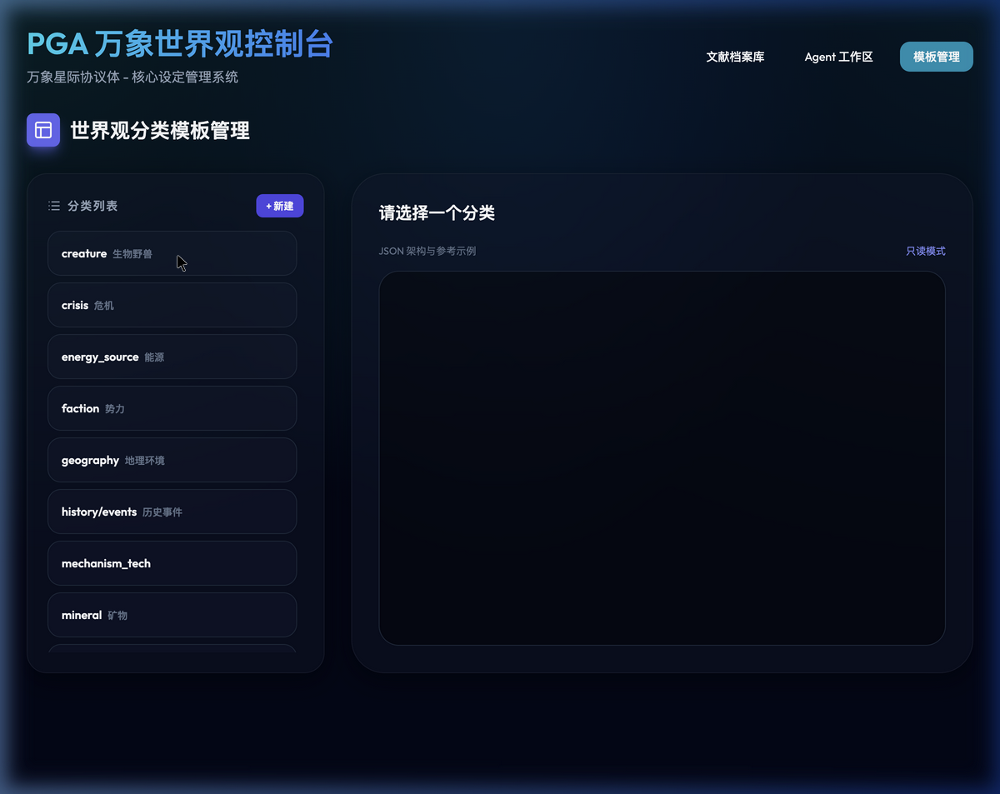
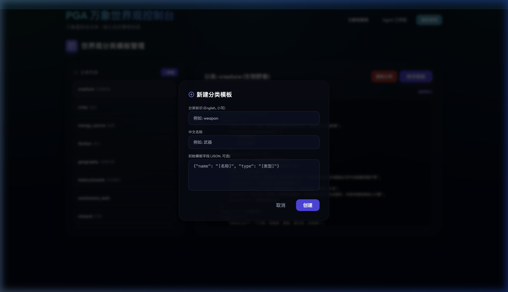
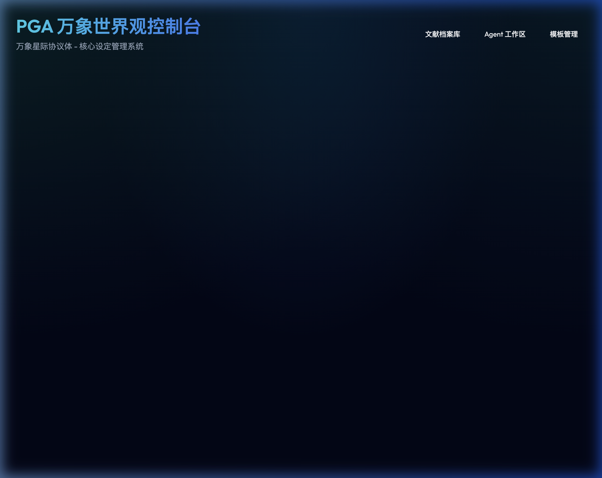
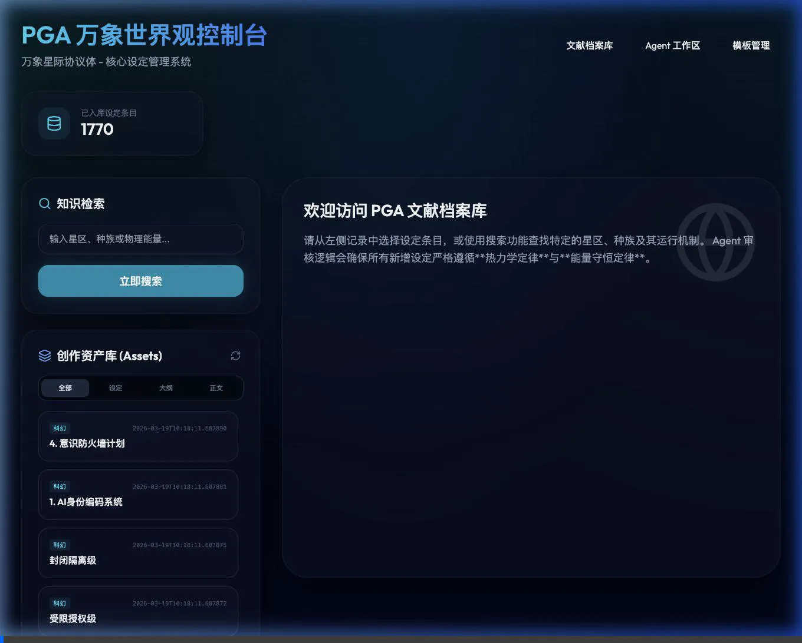

# Novel Agent (万象星际：AI 小说全链路创作引擎)

[English Version](./README_EN.md) | [中文版](./README.md)

> 本项目是一个基于 **LangGraph** 和 **Gemini** 驱动的专业小说创作与世界观管理系统。它通过 RAG（检索增强生成）和人机协作（Human-in-the-loop）将复杂的创作过程拆解为可管理的 Agent 流程，确保创作内容在长篇叙事中的高度一致性与逻辑严密性。

## 🌌 核心理念：结构化创作流程

系统将小说创作拆分为三个核心 Agent 阶段：

1. **世界观设定**：通过结构化模板定义种族、文明、技术、地理等底座设定。
2. **大纲规划**：基于世界观设定生成具有戏剧张力的剧情大纲与节奏控制。
3. **正文执行**：将大纲细化为具体场次，并生成带有“逻辑快照”的正文初稿。

---

### Technical Design Document: Worldview & Novel Agent

[English Version](./technical_design.md) | [中文版](./technical_design_ZH.md)

## ✨ 主要功能

### 1. 智能 Agent 矩阵

- **中转 Agent (Dispatcher)**: 语义识别与多级路由，自动分发请求至最匹配的子 Agent。
- **世界观 Agent (Worldview)**: 针对 Races, Geography, Factions 等多分类的设定生成与逻辑审计。
- **大纲 Agent (Outline)**: 结构化的小说策划，确保剧情冲突与世界观深度对齐。
- **正文 Agent (Execution)**: 基于“逻辑快照”的正文创作，通过场次拆解维持叙事连续性。

### 2. 世界观 Agent (Worldview Agent)

- **多维度设定**：支持 种族、势力、地理、机制、历史 等多维度设定。
- **模板化管理**：内置可视化模板 CRUD，支持手动编辑与 AI 自动补全。
- **语义分拣**：自动识别用户 Query 所属类别并提供针对性建议。

### 3. 小说大纲 Agent (Novel Outline Agent)

- **剧情节拍生成**：自动生成包含 序幕、发展、高潮、终局 的标准剧情节奏。
- **冲突挖掘**：自动分析设定中的核心冲突点，转化为故事张力。

### 4. 分布式技能体系 (Distributed Skill Architecture)

为了支持百万字以上的长篇巨著，系统引入了多级 SKILL 模块化管理：
- **框架法典 (Framework)**: 定义 Agent 的生成逻辑与审计红线。
- **核心锚点 (Lore/Anchors)**: 锁定不可修改的剧情转折与人物生死。
- **章节目录 (Catalog)**: 实现物理切片与活跃窗口管理，确保 Agent 在任何阶段都能高效处理任务。
-   **框架法典 (Framework)**: 定义 Agent 的生成逻辑与审计红线。
-   **核心锚点 (Lore/Anchors)**: 锁定不可修改的剧情转折与人物生死。
-   **章节目录 (Catalog)**: 实现物理切片与活跃窗口管理，确保 Agent 在任何阶段都能高效处理任务。

### 5. 自动化转换引擎 (Slicing Engine)

-   **物理切片**: 自动将庞大的章节目录切分为 50 章一档的物理文件。
-   **活跃窗口**: 智能提取当前任务前后的“高精细节”，防止 Context 膨胀导致的逻辑漂移。

### 6. 万象仪表盘 (Omni-Dashboard)

-   **主前端（React）**：`frontend/`，默认 `http://127.0.0.1:5174`，由 `make start` 拉起。
-   **可视化工作流**：直观展示 Agent 的思考与执行过程。
-   **人机协同**：支持在关键节点拦截任务，支持针对大纲或目录进行交互式增量修改。
-   **文献档案库**：统一检索存储在 MongoDB 与 ChromaDB 中的历史设定。
-   **世界层级 Agent 工作台**：`/worlds` 页面按 `世界 -> [世界观, 小说] -> 大纲 -> 章节` 管理业务实体；世界观记录世界规则与设定，小说记录这个世界发生的故事。创建/修改/删除通过独立 Agent 工作流推进，世界跳过审查，世界观、小说、大纲、章节必须经过审查与人工批准后才真实写库。

### 7. 全链路观测体系 (Full-Stack Observability)

-   **Sentry**: 后端错误捕捉与性能监控。
-   **LangFuse**: LangGraph 执行流追踪，实现 Prompt 与 Token 消耗的可回溯。
-   **Prometheus + Grafana**: 系统指标监控，包括自定义的 `llm_token_usage_total` 消耗统计。

---

## 📸 视觉演示

### 文献档案库 (Lore Library)



### 设定模板管理 (Template Management)



### Agent 创作工作区 (Writing Workspace)



### 核心工作流

1.  **Dispatcher (中转)**: 用户输入原始 Query -> 语义路由 -> 确定目标 Agent。
2.  **Analysis (分析/0-1)**: 依据 [info.md](./info.md) 进行规则自审与 Context 检索。
3.  **Draft (草案/2)**: 针对不同 Agent 生成世界观提案、剧情大纲或正文场次。
4.  **Audit (审计/3)**: 逻辑矛盾核查与能量守恒校准。
5.  **Canon (确立/4)**: 用户确认 -> 写入 `worldview_db.json` 与向量数据库。

### 系统演示 (录屏)



---

## 🛠️ 快速开始

### 1. 安装依赖

```bash
pip install -r requirements.txt
```

### 2. 配置环境

配置文件位于 `config/*.yml`，按模块拆分为 `llm.yml`、`embeddings.yml`、`storage.yml`、`observability.yml` 等。敏感信息建议放在 `.env`，也可以放在已被 git 忽略的 `config/secrets.yml`。

> [!TIP]
> **多项目隔离**：如果您有多个项目共享数据库，请通过修改 `MONGO_DB_NAME` 和 `CHROMA_COLLECTION_NAME` 来实现数据隔离。

### 3. 启动观测基础服务 (可选)

如果您需要使用 Prometheus 和 Grafana，或者需要独立的 MongoDB/ChromaDB 环境：

```bash
# 启动基础监控服务
cd observability
docker-compose up -d

# 启动项目专属数据库 (隔离模式)
cd ..
docker-compose up -d
```

### 4. 启动系统服务

**推荐方式（React 主前端 + API）：**

```bash
make install   # 首次：创建 .venv 并安装 Python + npm 依赖
make start     # API http://127.0.0.1:5006 + React http://127.0.0.1:5174
```

| 服务 | 端口 | 说明 |
|------|------|------|
| Flask API | `5006` | Agent 逻辑、数据库、层级 RAG |
| React 前端 | `5174` | **主 UI**：世界层级、小说管理、Agent 工作流 |

也可手动分终端启动：

```bash
# 终端 1 — 后端
env PYTHONPATH=.:src .venv/bin/python src/app_api.py

# 终端 2 — React 前端
cd frontend && npm run dev
```

> **NiceGUI 遗留 UI（已废弃）**：`ui/` 不再接受新功能。若仍需兼容旧环境，执行 `make install-legacy` 后 `make start-legacy-ui`（`:8501`）。详见 [docs/frontend_strategy.md](./docs/frontend_strategy.md)。


---

## ⚙️ 核心开发原则

- **双库事务性**：所有已批准设定同步更新 MongoDB（全文）和 ChromaDB（向量）。
- **世界层级模型**：MongoDB 使用 `worlds`、`worldviews`、`novels`、`outlines`、`prose`；`worldviews` 与 `novels` 同级归属于 `worlds`，章节继续存储在 `prose` 集合中。
- **禁止非世界全量查询**：除 `worlds` 列表外，世界观、小说、大纲、章节、工作流运行记录等查询接口必须同时提供业务条件和 `page/page_size`；缺失条件或分页时返回明确 `400`，不得回退到假数据或 JSONL 文件。
- **独立 Agent 工作流**：新增 `hierarchy_agent_runs` 集合记录 `world_agent`、`worldview_agent`、`novel_agent`、`outline_agent`、`chapter_agent` 的输入、草案、审查、人工反馈、真实写库节点；每个节点都可查看输入与输出。人工提交修改意见时默认 `局部重写`，也可以选择 `完全重写` 或 `小部分修改`；手动改过的表单字段会以 `manual_edit=true` 写入工作流。
- **迁移旧数据**：执行 `PYTHONPATH=.:src:src/common .venv/bin/python scripts/migrate_world_hierarchy.py` 可幂等补齐旧数据的 `world_id` 与 `novel_id`。
- **真实 API 测试**：执行 `API_BASE_URL=http://127.0.0.1:5006 .venv/bin/python tests/test_world_hierarchy_requests.py`，测试会用 `requests` 调真实接口并在每次增删改后查询验证结果。
- **真实 Agent 工作流测试**：执行 `API_BASE_URL=http://127.0.0.1:5006 .venv/bin/python tests/test_hierarchy_agent_workflow_requests.py`，测试会验证独立 Agent、审查节点、人工迭代、批准写库以及后续查询结果。
- **真实大纲章节工作流测试**：执行 `API_BASE_URL=http://127.0.0.1:5006 .venv/bin/python tests/test_outline_chapter_workflow_requests.py`，测试会验证状态查询必须带条件和分页，并检查章节真实写入、更新和查询结果。
- **自动生成后端 API 文档**：执行 `.venv/bin/python scripts/generate_api_docs.py`，脚本会从 `src/app_api.py` 的 Flask `@app.route` 自动生成 [docs/api.md](./docs/api.md) 和 [docs/openapi.json](./docs/openapi.json)。生成过程只解析源码 AST，不导入 Flask app、不连接 MongoDB、不执行业务处理器。

## 🔐 认证与 API Key

- **登录 Token**：注册或登录成功后生成，格式来自 `secrets.token_urlsafe(32)`，存储在 `auth_sessions.token`，用于 `Authorization: Bearer <token>`。
- **用户 API Key**：格式为 `na_` 前缀加 `secrets.token_urlsafe(32)`，生成结果存储在 MongoDB `users.api_key` 字段。
- **生成时机**：新用户在 `POST /api/auth/register` 时自动生成 API Key；旧用户如果没有 `api_key`，会在下一次 `POST /api/auth/login` 成功后自动补齐并持久化。
- **返回字段**：注册和登录接口都会返回顶层 `api_key`，同时在 `user.api_key` 中返回同一个值。
- **外部访问方式**：外部调用方可以不先登录，直接用用户 API Key 访问受保护接口，例如 `GET /api/auth/me`：

```http
X-API-Key: <api_key>
```

也支持：

```http
Authorization: ApiKey <api_key>
```

退出登录只会删除登录 Token，不会让用户 API Key 失效。

---

## 📄 开源协议

本项目采用 [MIT License](./LICENSE) 开源协议。
